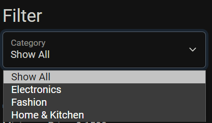
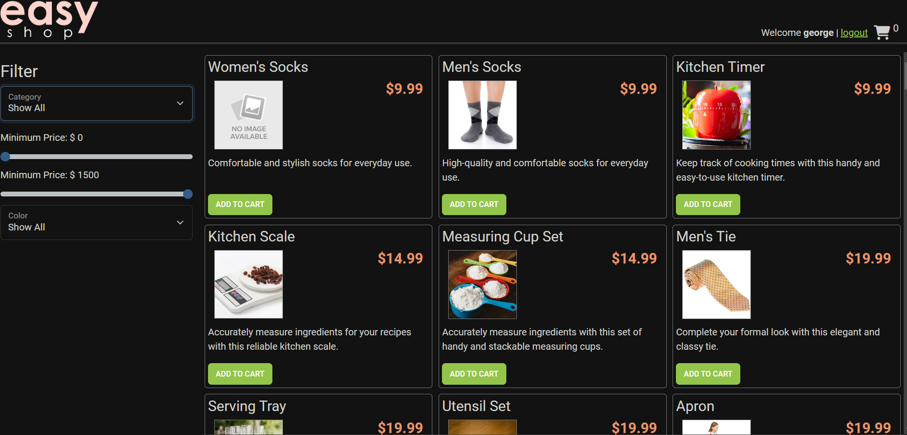

-Easy Shop Application Version 2 Overview-

-New Features & Bugs that were fixed are Listed Below-

- In this new version of the Easy Shop App, you can now do C.R.U.D(Create, Read, Update, Delete) Operations, which includes creating a new 
category or item of your choice, being able to find your specific item or category of choice by simply putting in the item/category id, being 
able to edit and update any item/category of your choice, and last but not the least being able to delete any item/category of choice.

- You can filter out the item type that you would like to be displayed.

- As soon as you load the application, Items are automatically listed in ascending order.

- Bug - Wasn't allowing the price to be filtered correctly from min price to max price (has been fixed).

- Bug - If you were trying to edit and update an item it was duplicating the item instead (has been fixed).

